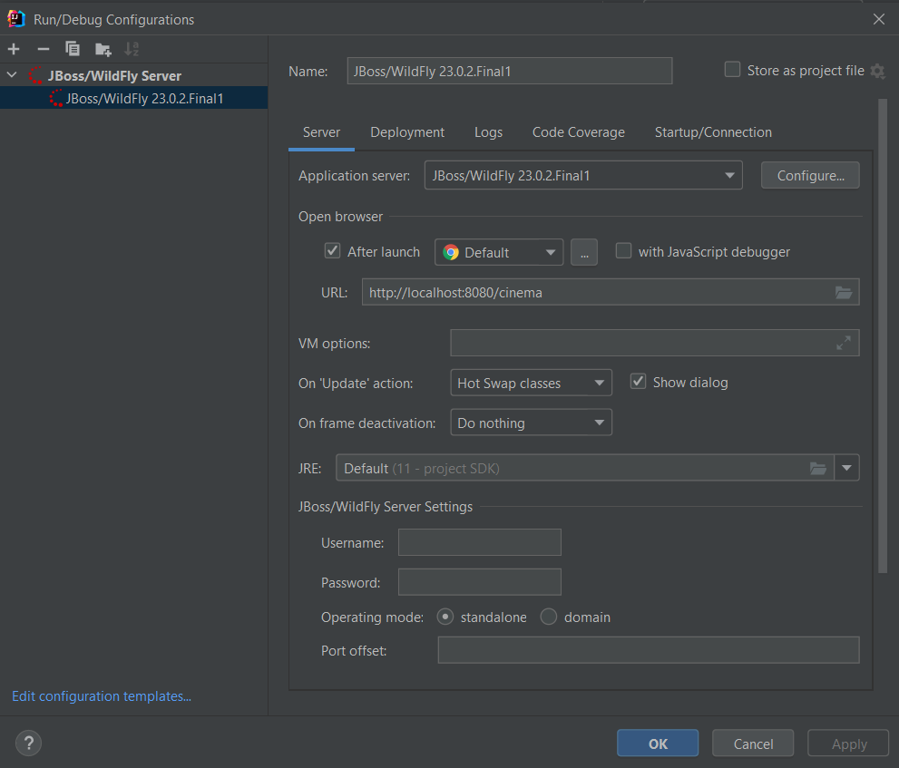
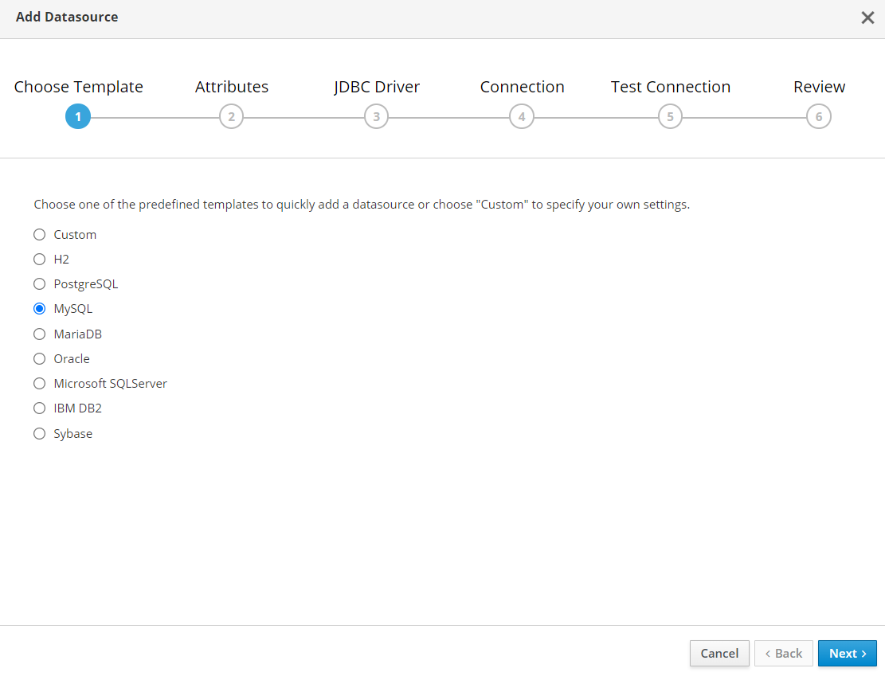
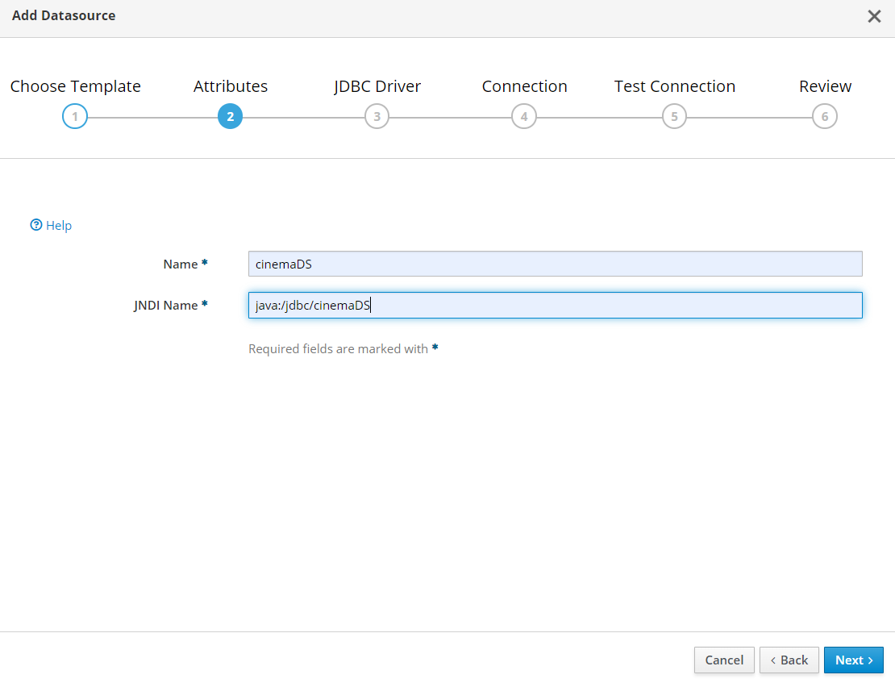
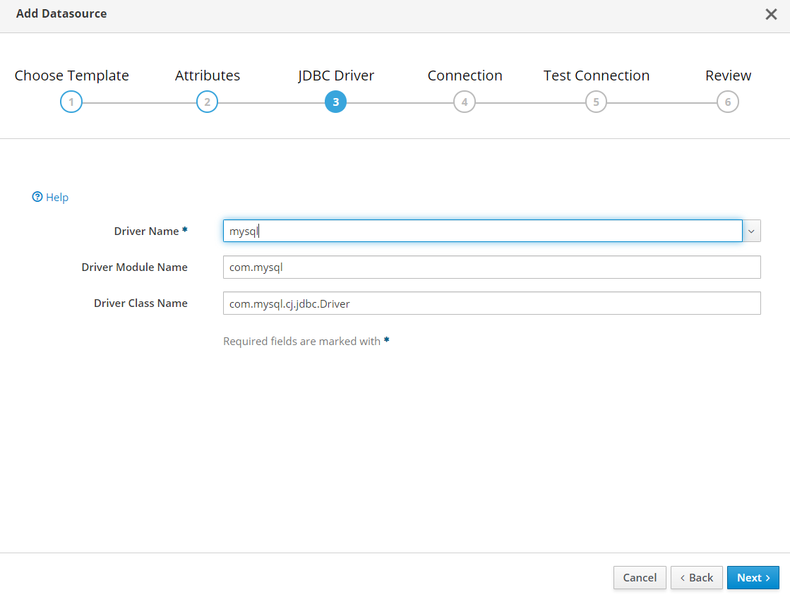
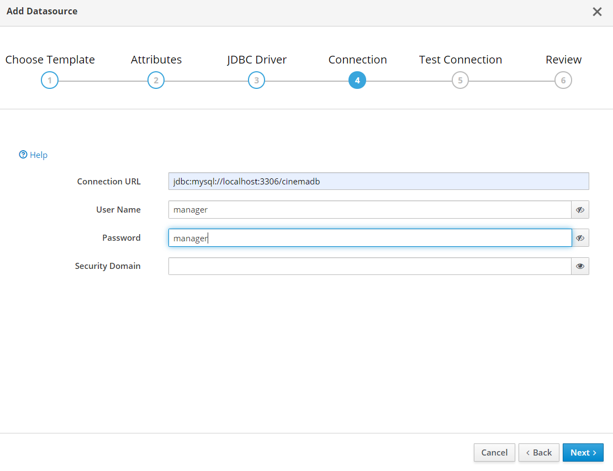
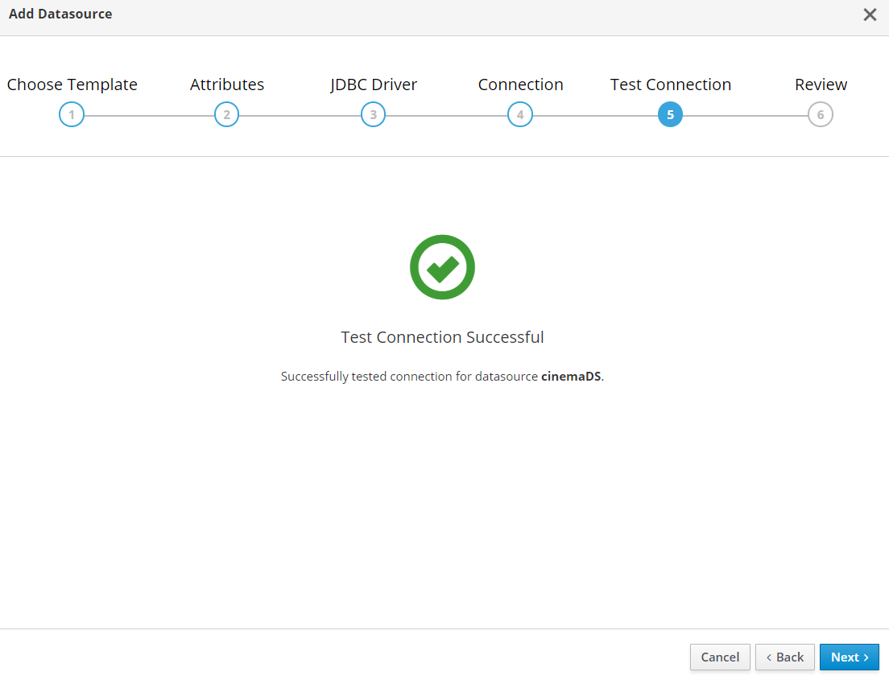

# Despliegue del proyecto

## Creación del contenedor de Docker
1. Descargamos la imagen de mysql
```
  docker pull mysql
```
2. Levantamos el contenedor de mysql; con cmd o powershell, accedemos a la carpeta donde tenemos ubicado el docker-compose del proyecto y escribimos el comando:
```
  docker compose up -d
```
## Conexión y acceso a la base de datos
Entramos en Dbeaver y creamos una conexión mysql (la contraseña del usuario root está definida en el docker-compose.yml); 
***
    Nueva conexión -> Mysql -> Rellenamos los siguientes datos:
    Server Host: localhost   Puerto: 3306
    Database: mysql
      Nombre de usuario: root
      Contraseña: maria   
***


Ahora podremos comprobar que se ha creado la base de datos que vamos a usar en esta conexión


## Damos privilegios a nuestro usuario
Creamos un script en la conexión mysql para acceder y concedemos todos los privilegios al usuario que hemos establecido en el yml como usuario para nuestra base de datos (ejecutamos ambas líneas en este mismo orden);
```
use mysql;
GRANT ALL PRIVILEGES ON cinemadb.* TO 'manager'@'localhost';
```

## Creación del Datasource

Ahora crearemos el datasource para conectar la base de datos con wildfly. Para ello, primero abrimos el proyecto en IntelliJ y creamos una configuración JBoss/wildfly como en la siguiente imagen (en Application server se debe configurar el widfly que tengas instalado en tu ordenador):



Clicamos en 'Run JBoss/Wildfly' Accedemos al puerto 9990 en el navegador:

http://localhost:9990/

El usuario y la contraseña son ambas 'admin'
***
    Configuration -> Subsystem -> Datasources & Drivers -> Datasources -> Add Datasaource
***
Ahora seguimos los pasos según indican las imágenes:







Guardamos el Datasource creado y recargamos el servicor (aparecerá una pestañita arriba a la derecha indicándonos que debemos recargarlo; simplemente clicacmos en Reload)

## Carga de datos a la base de datos
Cargamos los datos a la base de datos del script que se incluye en el proyecto (cinemadb-data.sql)
- COMPROBAR QEU ESTOS SON LOS PASOS CON UN SQL NORMAL
***
    Boton derecho sobre la base de datos -> herramientas -> restore database -> seleccionas el archivo mysql en el campo Input File -> cliacas en aceptar -> renovar la base de datos
***
Comprobamos que todos los datos se crearon correctamente

Ahora ya ponemos acceder a http://localhost:8080/cinema/mvc/pelicula para descubri la aplicación. Para más explicaciones sobre su utilización, acceda al README.md del proyecto